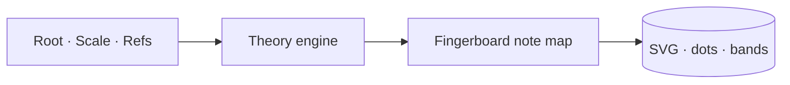

## Diagrams

<!-- PRIMARY comprehension surface. Reviewers should be able to grasp the full
change from the diagram(s) alone — Summary and code diff are supporting context,
not the primary explanation. Replace the example below with your own diagram(s).
Good shapes: data flows, sequence diagrams, state machines, component trees,
token/theme graphs, route maps. Multiple diagrams are encouraged when the PR
spans layers. If the change genuinely cannot be diagrammed (one-line typo, dep
bump, docs-/comment-only), delete the block and write: N/A — <reason> -->

## Summary

<!-- 1–3 bullets supporting the diagram(s) above. Lead with the *why* — the
diagram shows the *what*. -->

-
-

## Screenshots

<!-- REQUIRED when this PR adds or modifies visible UI. Otherwise write
"N/A — not UI".

Upload screenshots via the user-attachments paste flow (skill:
`~/.claude/skills/pr-screenshots-via-user-attachments/`). This produces
`user-attachments/assets/<uuid>` URLs that are CDN-hosted, repo-independent,
and survive branch deletion. Do NOT commit PNGs to the repo and do NOT use
`raw.githubusercontent.com` URLs. -->

- [ ] Captured at ≥1 mobile (390×844) and ≥1 desktop (1440×900) viewport
      (or marked `N/A — not UI`)
- [ ] Matches the design language in `DESIGN.md` — tokens, spacing, type, and
      motion as specified (or marked `N/A — not UI`)

## Test plan

<!-- Checklist of the verifications you ran. Reviewers expect all boxes checked
on a ready-to-merge PR. Mark any line `N/A — <reason>` when it doesn't apply
(e.g. a docs-only change). The `pnpm …` lines below run the real four gates
(typecheck / lint / test / build) wired through `turbo.json` and CI
(`.github/workflows/ci.yml`); for a docs-only change run whatever checks the
change actually has (e.g. `scripts/check-claude-shim.sh`) and mark the others
`N/A — <reason>`. -->

- [ ] `pnpm typecheck && pnpm lint && pnpm test` — green, or `N/A — <reason>`
- [ ] New unit / integration tests added (if behavior changed)
- [ ] New Playwright e2e spec added (if user-visible behavior changed)
- [ ] `pnpm build` — clean production build (static assets under `apps/web/dist/`), or `N/A — <reason>`
- [ ] Updated every drift-prone doc this change affects — `AGENTS.md` /
      `CLAUDE.md` / `README.md` / `SECURITY.md` / `DESIGN.md` / this template /
      specs — or `N/A — <reason>`. (If `CLAUDE.md` or `AGENTS.md` changed:
      `scripts/check-claude-shim.sh` passes.)
- [ ] (UI only) Playwright MCP smoke — ran `pnpm dev`, drove the
      feature via `mcp__plugin_playwright_playwright__browser_*` at ≥1 mobile
      (390×844) and ≥1 desktop (1440×900) viewport, `browser_console_messages`
      returns no errors/warnings, and the Screenshots section was captured from
      those runs. Reviewers repeat the drive + console check via
      `gh pr checkout <N>` + `pnpm dev` against
      the PR head SHA before approving.

## Plan / issue reference

<!-- Link the issue and/or execution plan this PR implements. For out-of-plan
work, write "Out of plan — <one-line reason>". -->

Closes #<issue>.

---

🤖 Generated with [Claude Code](https://claude.com/claude-code)
