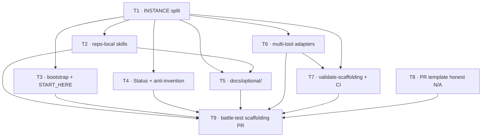

# Template prep (bucket A) — violin-tools

**Status:** complete · **Goal:** make `julianken/violin-tools` self-contained enough to templatize later without grep-and-hope.

T1–T8 landed on `main`; T9 (this plan's capstone) is the battle-test PR that exercised the full scaffolding loop — branch → five-section PR → `@julianken-bot` review → Mergify queue → green scaffolding CI — end to end. Bucket A is done; the public template repo (bucket B) is the next phase.

**Not in bucket A:** creating the public template repo, empty SPEC/DESIGN stubs, `package.json`, app CI, placeholder substitution scripts (bucket B — after templatization).

This file is a **portable program overview**: scope and dependencies expressed with local plan IDs, not host-specific tracker links. The tracker (GitHub issues, Linear, etc.) is an implementation detail and can vary by repo.

## Dependency graph

## Work items

| Plan ID | Deliverable | Status |
| --- | --- | --- |
| T1 | Split `INSTANCE.md` from `AGENTS.md` | done |
| T2 | Add repo-local `creating-prs` and `reviewing` skills | done |
| T3 | Add `project-bootstrap` (validate mode) + `START_HERE.md` | done |
| T4 | Add lifecycle status + anti-invention rules | done |
| T5 | Move personal infra guidance to `docs/optional/` | done |
| T6 | Add multi-tool adapters (`GEMINI.md`, Copilot instructions) | done |
| T7 | Add `validate-scaffolding.sh` + scaffolding CI | done |
| T8 | Mark PR template test/build lines as not configured | done |
| T9 | Battle-test full scaffolding PR flow | done (this PR) |

## Tracker mapping

If a repo uses an external tracker, map tracker IDs to `T1`-`T9` in that tracker. Keep this file free of tracker-specific links so it can be copied without rewriting.

## Issue quality bar

Implementation issue/spec authoring should follow `.claude/skills/issue-authoring/SKILL.md`, and each spec should be gated by `.claude/skills/issue-plan-review/SKILL.md` before implementation starts.

**Never cite** paths that are not on `main` (no local-only working folders).
