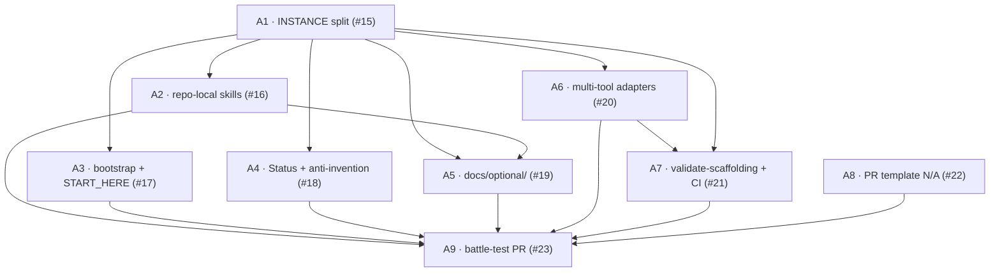

# Template prep (bucket A) — violin-tools

**Status:** in progress · **Goal:** make `julianken/violin-tools` self-contained enough to templatize later without grep-and-hope.

**Not in bucket A:** creating the public template repo, empty SPEC/DESIGN stubs, `package.json`, app CI, placeholder substitution scripts (bucket B — after templatization).

This file is the **program overview** — dependency graph and scope boundaries. Each work item's full spec lives on **GitHub** (issues below). There is no parallel `docs/plans/issues/` tree; issue bodies are the source of truth.

## Why issues start at #15

Issues #1–#14 are earlier repo work (Claude buildout, Cursor parity, Figma wiring, etc.). Template prep was filed as a **batch of nine issues** (#15–#23), not as "plan items 1–9" in git. Plan IDs below (A1–A9) are for readability; GitHub numbers are the tracker IDs.

## Dependency graph

## Work items

| Plan | Issue | Title |
| --- | --- | --- |
| A1 | [#15](https://github.com/julianken/violin-tools/issues/15) | Split `INSTANCE.md` from `AGENTS.md` |
| A2 | [#16](https://github.com/julianken/violin-tools/issues/16) | Repo-local `creating-prs` + `reviewing` skills |
| A3 | [#17](https://github.com/julianken/violin-tools/issues/17) | `project-bootstrap` (validate) + `START_HERE.md` |
| A4 | [#18](https://github.com/julianken/violin-tools/issues/18) | Status + anti-invention rules |
| A5 | [#19](https://github.com/julianken/violin-tools/issues/19) | `docs/optional/` modules |
| A6 | [#20](https://github.com/julianken/violin-tools/issues/20) | `GEMINI.md` + copilot-instructions |
| A7 | [#21](https://github.com/julianken/violin-tools/issues/21) | `validate-scaffolding.sh` + CI |
| A8 | [#22](https://github.com/julianken/violin-tools/issues/22) | PR template `not configured` lines |
| A9 | [#23](https://github.com/julianken/violin-tools/issues/23) | Battle-test scaffolding PR |

## Issue quality bar

Implementation issues use `.claude/skills/issue-authoring/SKILL.md` (exemplar: [#10](https://github.com/julianken/violin-tools/issues/10)). Before coding, dispatch `issue-plan-review` for a `@julianken-bot` plan review.

**Never cite** paths that are not on `main` (no local-only working folders).
