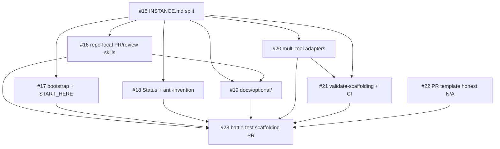

# Template prep (bucket A) — violin-tools

**Status:** in progress · **Goal:** make `julianken/violin-tools` self-contained enough to templatize later without grep-and-hope.

**Not in bucket A:** creating the public template repo, empty SPEC/DESIGN stubs, `package.json`, app CI, placeholder substitution scripts (bucket B — after templatization).

## Why bucket A exists

The repo already encodes strong **process** (`AGENTS.md`, skills, Mergify, bot review) mixed with **instance** facts (violin product, Figma IDs, GitHub slug). Templatization requires separating those layers and making skills readable without `~/.claude/skills/`.

## Dependency graph

## Work items (GitHub issues)

| Issue | Title | Notes |
| --- | --- | --- |
| [#15](https://github.com/julianken/violin-tools/issues/15) | Split `INSTANCE.md` from `AGENTS.md` | First — unlocks clean extraction |
| [#16](https://github.com/julianken/violin-tools/issues/16) | Repo-local `creating-prs` + `reviewing` skills | Refactor `pr-workflow` to instance-only |
| [#17](https://github.com/julianken/violin-tools/issues/17) | `project-bootstrap` (validate) + `START_HERE.md` | Validate mode only — no domain wipe |
| [#18](https://github.com/julianken/violin-tools/issues/18) | Status + anti-invention rules | May ship in same PR as #15 |
| [#19](https://github.com/julianken/violin-tools/issues/19) | `docs/optional/` modules | Mergify, bot, Figma, user-skills |
| [#20](https://github.com/julianken/violin-tools/issues/20) | `GEMINI.md` + copilot-instructions | Thin pointers — no rule duplication |
| [#21](https://github.com/julianken/violin-tools/issues/21) | `validate-scaffolding.sh` + CI | Fires GAPS CI-shim row |
| [#22](https://github.com/julianken/violin-tools/issues/22) | PR template `not configured` lines | Can parallel #15 |
| [#23](https://github.com/julianken/violin-tools/issues/23) | Battle-test scaffolding PR | Capstone before templatization |

## Issue quality bar

Implementation issues use the shape in `.claude/skills/issue-authoring/SKILL.md` (exemplar: [#10](https://github.com/julianken/violin-tools/issues/10)). Before coding, dispatch `issue-plan-review` for a `@julianken-bot` plan review.

**Never cite** paths that are not on `main` (no local-only `research/` folders).
